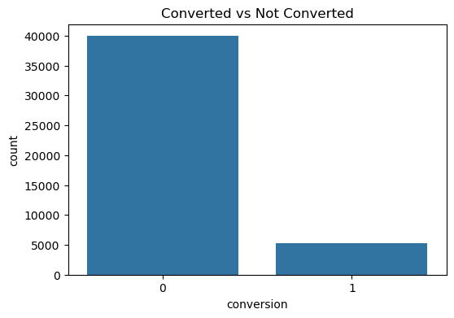
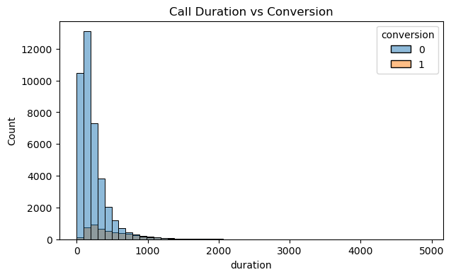
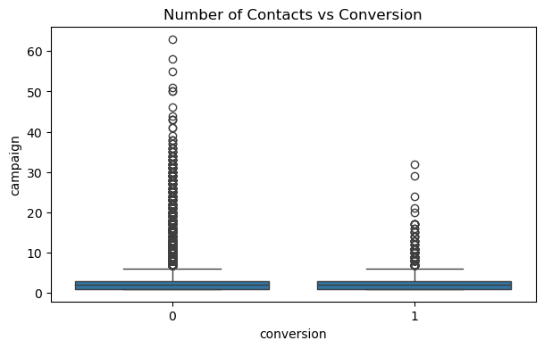

# Marketing Funnel & Conversion Analysis

## Project Overview
This project analyzes a marketing campaign dataset to understand customer conversion behavior and identify factors affecting subscription success.

## Tools Used
Python, Pandas, Matplotlib, Seaborn

## Dataset
Bank Marketing Campaign Dataset

## Analysis Performed
- Conversion rate calculation
- Customer engagement analysis
- Contact frequency impact analysis

## Key Insights
- Overall campaign conversion rate is low (~11–12%)
- Longer customer conversations significantly increase conversion probability
- Repeated contact attempts reduce chances of subscription

## Business Recommendations
- Improve targeting strategy
- Focus on meaningful conversations rather than quick calls
- Limit excessive follow-up contacts

## Visualizations

### Conversion Distribution

### Call Duration Impact

### Contact Frequency Impact

## Conclusion
The analysis highlights how customer engagement and contact strategy influence marketing campaign success and provides actionable steps to improve conversion rates.
